## **Problem Statement**

e-Waste is rising as devices are thrown away instead of reused. Every year, millions of phones, laptops, and gadgets end up in landfills, leaking harmful chemicals into the environment. People often replace devices quickly instead of repairing, recycling, or passing them on to someone who needs them.

### **Solution: Swapify**

**Swapify** is a community-driven platform where people can **donate, sell, or exchange their unused electronics and items locally**—with a strong focus on **reuse and sustainability**.

*“If you have more than what you need, simply give it to those who need it the most.”*

* Instead of throwing away old or unused devices, users can list them on Swapify to be **donated, sold at an affordable price, or exchanged**.
* The platform encourages **repair and recycling** by connecting people who have unused items with those who can fix, repurpose, or use them.
* By enabling **local meetups only (no shipping)**, Swapify reduces carbon footprint and builds community trust.
* This helps extend the lifecycle of electronics, reduce e-waste, and promote a **circular economy** where resources are continuously reused.

In short, Swapify empowers people to **donate, sell, recycle, and reuse electronics and other items**—so they don’t end up in landfills, but instead find a **second life** in someone’s hands.

### **How We Are Different**

To make the platform safe and trustworthy:

* We use a **dedicated Admin Panel with AI-powered listing approvals** to reduce spam and scams.
* Strict rules are implemented for both **users and listings**.
* Each region has **dedicated admins** to manage local activity and ensure quality.

## Application Screenshots

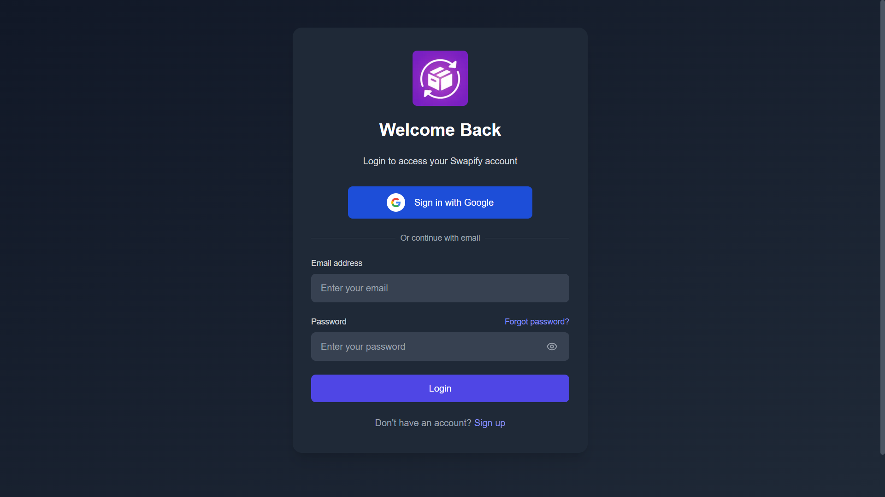
*Login Screen*

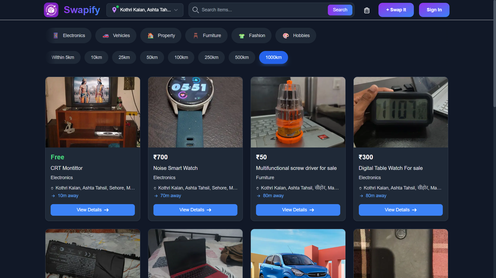
*Home Page (Feed):People can See Nearby Listing Items*

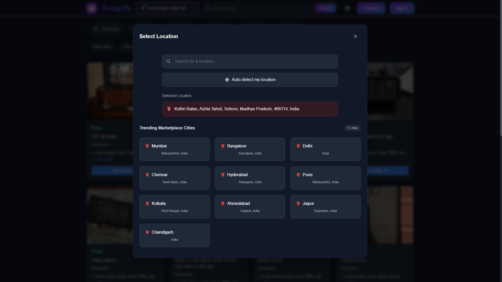
*Users Can One click Autodetect or Manually Select Their Location*

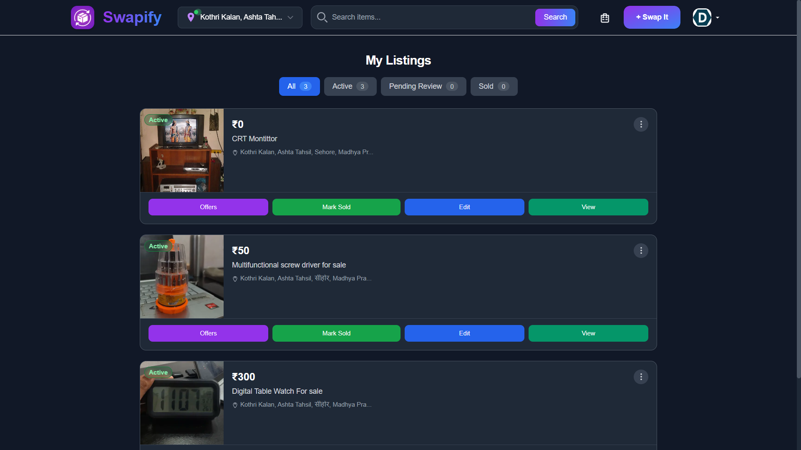
*My Listings Page: Users Can Manage their Listed items*

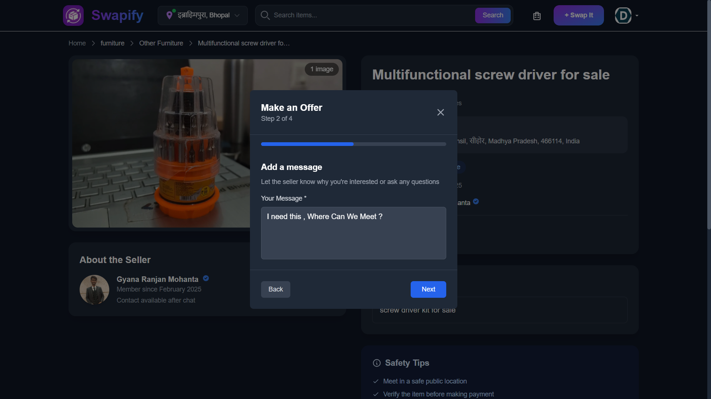
*Interested Buyers , Can Make An Offer for the Listing*

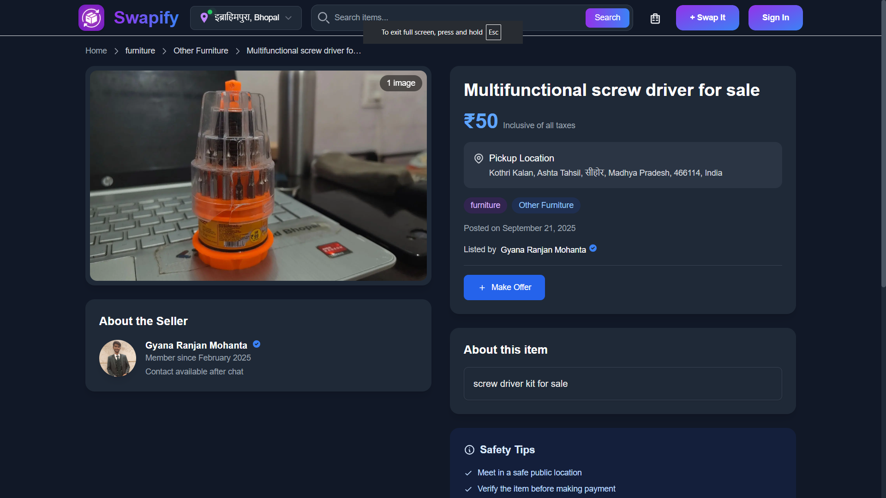
*Listings Page: Users Can Check details about the Listed items*

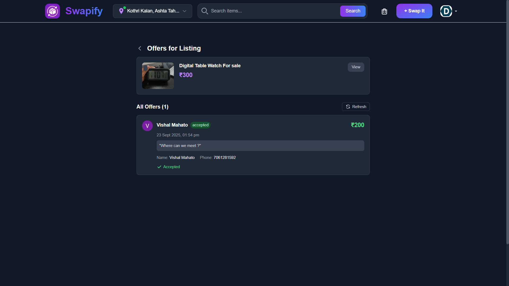
*My Offers Page: Sellers Can Check the Buyers Offers*

## Manager & Admin Panel (CRM Screenshots)

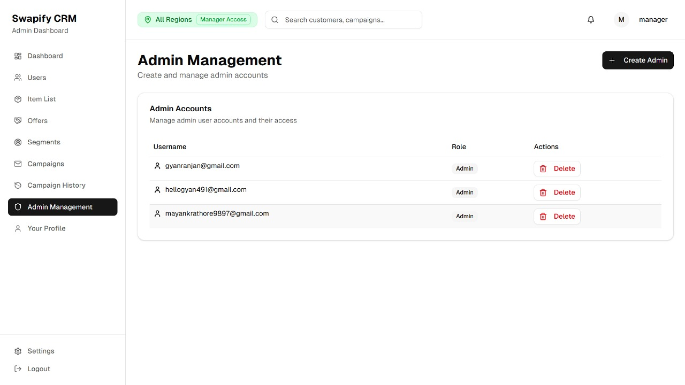
*Manager Panel: Manager has the access the approve admins for a pearitcular selecteed region Ex:  Kothri Kalan*

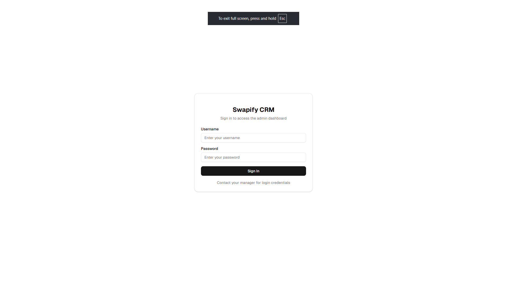
*Login Page:  Only Approved Admins For a Selected Region can Access the Admin Panel Ex: Admin Who has access to kothrikalan listing can approve and manage the listings*

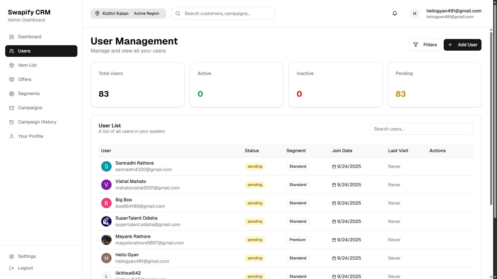
*User Management: Admin Have the Control To block, Approve and manage users*

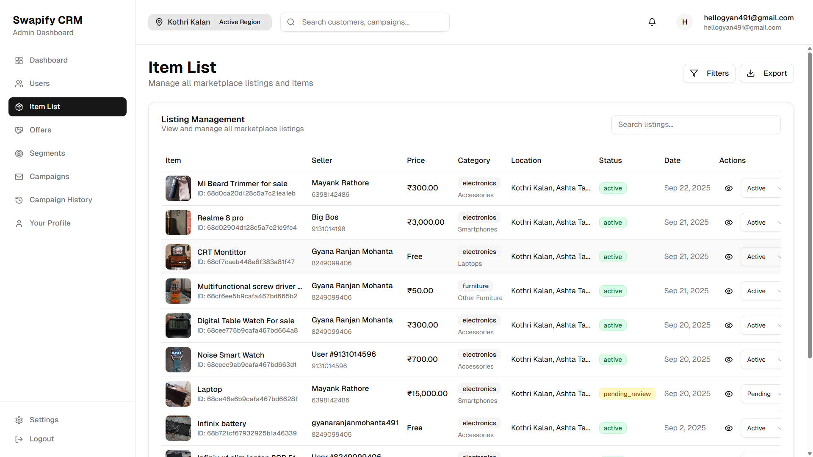
*Listing Management: Admin Have the Control To Manage The Lisitings, Approve and manage Lsitings prevent spams and scams*

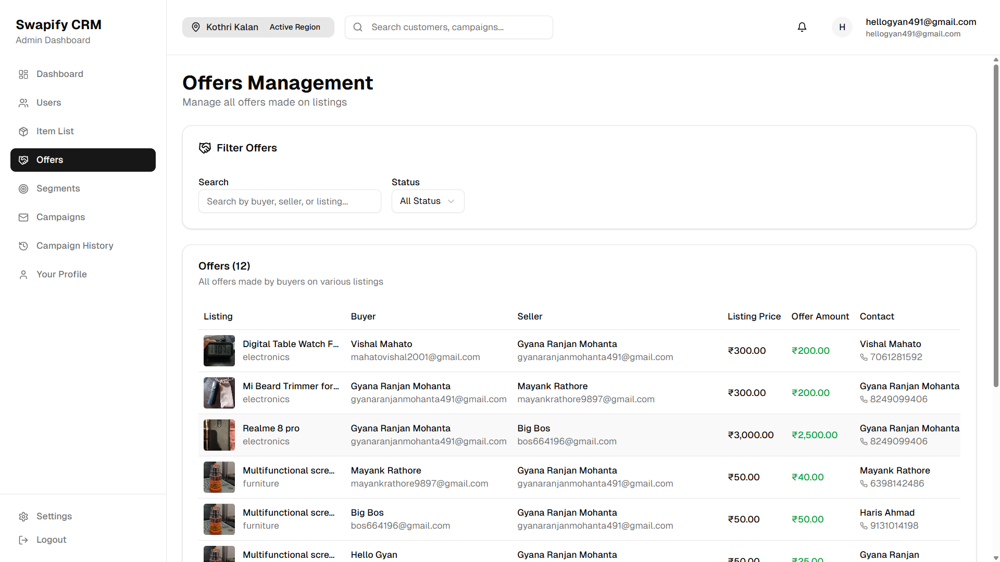
*Offer Management: Admin Have the Control To Manage The Offers, Approve and manage Offers prevent spams and scams*
